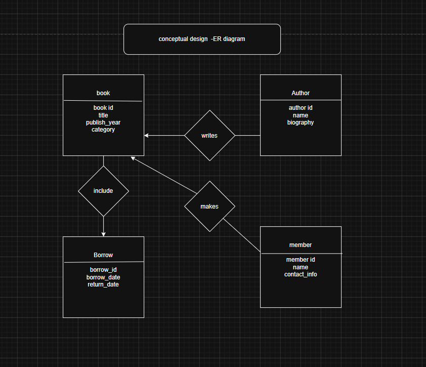
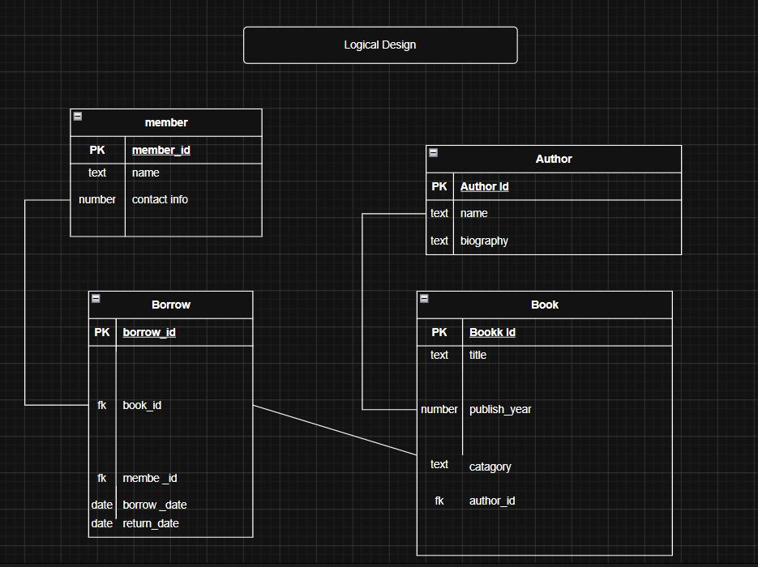

# library-management-system
library management system using database design
#  Library Management System

##  Overview
A database system to manage books, authors, members, and borrowing operations.

---

## ⚙️ Features
- Add books and authors
- Register members
- Borrow and return books
- Track book availability

---

## 🧩 Project Steps

### 1. Requirement Analysis
Define system data, operations, and relationships.

### 2. Conceptual Design
Create ER Diagram to represent entities and relationships.

### 3. Logical Design
Convert ERD into relational tables.

### 4. Physical Design
Implement database using SQL.

---

## 🔗 Quick Access

- 📄 [Requirement Analysis](requirements/requirements.md)
- 🧠 [Conceptual Design](design/conceptual.png)
- 🗂 [Logical Design](design/logical.png)
- 🛠 [SQL Schema](database/schema.sql)

---

## 📷 Diagrams

### Conceptual Design

### Logical Design

